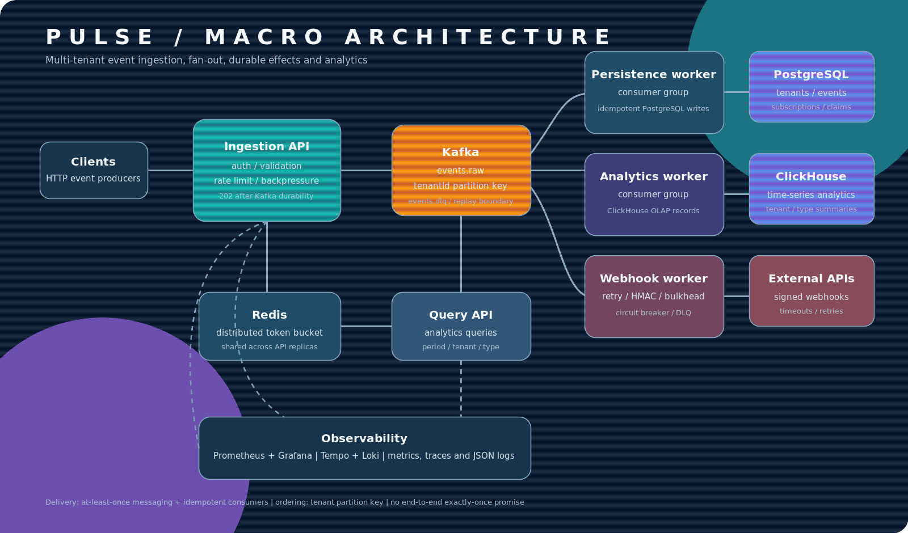

# Pulse

Pulse is a multi-tenant event platform for HTTP ingestion, Kafka fan-out,
durable persistence, analytics, and webhook delivery. The repository contains
the Go services, Docker Compose environment, Helm chart, observability assets,
and executable integration, load, and chaos tests.

## Documentation status

This documentation baseline is complete, but execution evidence is not filled
in yet. `PENDING` means that a measurement or validation has not been executed
in the documented environment; it is not a claim of success.

The plan targets 100,000 events/s, ingestion p95 below 100 ms, p99 below 250
ms, zero silent loss of accepted events, zero duplicate effects, and 99.95%
availability. These are targets, not measured results. See
[`docs/benchmarks/README.md`](docs/benchmarks/README.md) and
[`docs/FINAL_VALIDATION_REPORT.md`](docs/FINAL_VALIDATION_REPORT.md) for the
result templates.

## Architecture at a glance



The PNG above shows the runtime flow at a macro level: authenticated clients
publish durable events through the ingestion API and Kafka, independent worker
groups apply effects to PostgreSQL, ClickHouse and external webhooks, while
Redis and the observability stack support the platform. The editable sources
are [`pulse-architecture.svg`](docs/architecture/pulse-architecture.svg) and
[`diagram.mmd`](docs/architecture/diagram.mmd).

```text
Clients -> ingestion -> Kafka events.raw
                         |       |        |
                 persistence  analytics  webhook
                    worker     worker     worker
                      |          |          |
                 PostgreSQL  ClickHouse  external APIs

Redis provides distributed rate limiting. query-api serves analytics.
Prometheus, Grafana, Loki, and Tempo provide observability.

Webhook endpoints are resolved and checked against private, loopback, link-local,
and metadata address ranges on every delivery. `PULSE_ALLOW_PRIVATE_WEBHOOKS=true`
is reserved for the isolated Compose E2E profile and must not be enabled in
production.
```

The detailed overview and Mermaid diagram are in
[`docs/architecture/overview.md`](docs/architecture/overview.md) and
[`docs/architecture/diagram.mmd`](docs/architecture/diagram.mmd).

## Current delivery semantics

- Ingestion publishes synchronously to Kafka with `RequiredAcks=all` and only
  returns `202 Accepted` after the publish call succeeds.
- Consumers use at-least-once processing and commit offsets after successful
  handling.
- PostgreSQL enforces uniqueness on `(tenant_id, event_id)`.
- Webhook claims enforce uniqueness on `(tenant_id, event_id, subscription_id)`
  before an external side effect is attempted.
- Terminal consumer failures can be written to `events.dlq`.
- End-to-end exactly-once processing is not promised.
- These properties still require the integration, load, and chaos evidence
  listed in the final validation report.

## Quick start

Requirements: Go, Docker Compose, `curl`; `k6`, Helm, `promtool`, and
`govulncheck` are required only for the targets that use them.

```sh
cp .env.example .env
make up
make e2e
make down
```

For a clean local environment, use `make clean` before `make up`. Do not use
the local fallback as production evidence; it is intended for local ingestion
tests only.

## Make targets

| Target | Purpose |
| --- | --- |
| `make up` | Build and start the Compose stack. |
| `make down` | Stop the Compose stack without removing volumes. |
| `make clean` | Stop the stack and remove volumes/orphans. |
| `make fmt` | Fail if Go formatting would change files. |
| `make vet` | Run `go vet ./...`. |
| `make lint` | Run formatting and vet checks. |
| `make test` | Run Go tests. |
| `make race` | Run `go test -race ./...`. |
| `make build` | Build all commands under `cmd/`. |
| `make integration` | Start Compose and run Go integration coverage. |
| `make e2e` | Wait for readiness and validate HTTP health endpoints. |
| `make load-smoke` | Run the configured k6 smoke script. |
| `make validate` | Validate Compose, Helm when installed, and Prometheus when installed. |
| `make scan` | Run `govulncheck ./...`. |

The external test suites have explicit environment and safety gates. Their
commands are documented in `tests/integration/README.md`,
`tests/e2e/README.md`, `tests/load/README.md`, and `tests/chaos/README.md`.

## Load and chaos execution

Load profiles require a reachable ingestion URL and API key:

```sh
PULSE_API_URL=http://127.0.0.1:8080 PULSE_API_KEY=... scripts/run-k6.sh smoke
PULSE_API_URL=http://127.0.0.1:8080 PULSE_API_KEY=... scripts/run-k6.sh baseline
```

The progression, stress, spike, and soak profiles are described in
[`docs/benchmarks/README.md`](docs/benchmarks/README.md). Chaos is destructive
to service availability and requires the explicit gates described in
[`tests/chaos/README.md`](tests/chaos/README.md).

## API

The source of truth for the documented HTTP surface is
[`docs/api/openapi.yaml`](docs/api/openapi.yaml). It includes tenant creation
and key rotation, event ingestion, webhook creation, analytics summary,
health, and metrics routes.

## Operations and security

- Runbooks: [`docs/runbooks/README.md`](docs/runbooks/README.md)
- Troubleshooting: [`docs/troubleshooting.md`](docs/troubleshooting.md)
- SLI/SLO: [`docs/operations/sli-slo.md`](docs/operations/sli-slo.md)
- Capacity planning: [`docs/capacity-planning.md`](docs/capacity-planning.md)
- Security considerations: [`docs/security.md`](docs/security.md)
- Chaos report: [`docs/chaos-report.md`](docs/chaos-report.md)
- Architecture decisions: [`docs/adr/`](docs/adr/)

## Validation and remaining evidence

The repository has not been treated as validated merely because it compiles.
Run the plan's validation sequence and record its output in
[`docs/FINAL_VALIDATION_REPORT.md`](docs/FINAL_VALIDATION_REPORT.md):

```sh
make clean
make up
make lint
make test
make race
make integration
make e2e
make load-smoke
make validate
```

The report must be updated with the tested commit, date, hardware, versions,
throughput, p50/p95/p99, error rate, consumer lag, load profiles, chaos
observations, security checks, limitations, and unmet criteria. Until those
fields are filled with captured evidence, the project status is **not
validated**.
